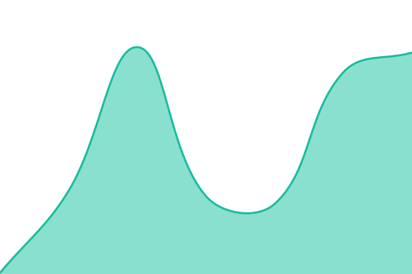
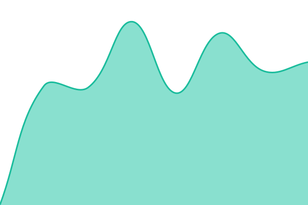

# [📈 Live Status](https://status.rustunnel.com): <!--live status--> **All systems operational**

This repository contains the open-source uptime monitor and status page for [João Henrique Machado Silva](https://thepolyglotprogrammer.com/), powered by [Upptime](https://github.com/upptime/upptime).

With [Upptime](https://upptime.js.org), you can get your own unlimited and free uptime monitor and status page, powered entirely by a GitHub repository. We use [Issues](https://github.com/joaoh82/rustunnel-status/issues) as incident reports, [Actions](https://github.com/joaoh82/rustunnel-status/actions) as uptime monitors, and [Pages](https://status.rustunnel.com) for the status page.

<!--start: status pages-->
<!-- This summary is generated by Upptime (https://github.com/upptime/upptime) -->
<!-- Do not edit this manually, your changes will be overwritten -->
<!-- prettier-ignore -->
| URL | Status | History | Response Time | Uptime |
| --- | ------ | ------- | ------------- | ------ |
|  [Marketing site](https://rustunnel.com) | 🟩 Up | [marketing-site.yml](https://github.com/joaoh82/rustunnel-status/commits/HEAD/history/marketing-site.yml) | 

 508ms
     
 | 

<a href="https://status.rustunnel.com/history/marketing-site">100.00%</a>
    

|  [Platform API](https://api.rustunnel.com/health) | 🟩 Up | [platform-api.yml](https://github.com/joaoh82/rustunnel-status/commits/HEAD/history/platform-api.yml) | 

 480ms
     
 | 

<a href="https://status.rustunnel.com/history/platform-api">100.00%</a>
    

|  [Platform API — Database](https://api.rustunnel.com/health/db) | 🟩 Up | [platform-api-database.yml](https://github.com/joaoh82/rustunnel-status/commits/HEAD/history/platform-api-database.yml) | 

 479ms
     
 | 

<a href="https://status.rustunnel.com/history/platform-api-database">100.00%</a>
    

|  [EU edge — control plane](https://eu.edge.rustunnel.com:8443/api/status) | 🟩 Up | [eu-edge-control-plane.yml](https://github.com/joaoh82/rustunnel-status/commits/HEAD/history/eu-edge-control-plane.yml) | 

 466ms
     
 | 

<a href="https://status.rustunnel.com/history/eu-edge-control-plane">100.00%</a>
    

|  [US edge — control plane](https://us.edge.rustunnel.com:8443/api/status) | 🟩 Up | [us-edge-control-plane.yml](https://github.com/joaoh82/rustunnel-status/commits/HEAD/history/us-edge-control-plane.yml) | 

 224ms
     
 | 

<a href="https://status.rustunnel.com/history/us-edge-control-plane">100.00%</a>
    

|  [AP edge — control plane](https://ap.edge.rustunnel.com:8443/api/status) | 🟩 Up | [ap-edge-control-plane.yml](https://github.com/joaoh82/rustunnel-status/commits/HEAD/history/ap-edge-control-plane.yml) | 

 667ms
     
 | 

<a href="https://status.rustunnel.com/history/ap-edge-control-plane">100.00%</a>
    

|  [EU edge — synthetic tunnel](https://synthetic.eu.edge.rustunnel.com) | 🟩 Up | [eu-edge-synthetic-tunnel.yml](https://github.com/joaoh82/rustunnel-status/commits/HEAD/history/eu-edge-synthetic-tunnel.yml) | 

 486ms
     
 | 

<a href="https://status.rustunnel.com/history/eu-edge-synthetic-tunnel">100.00%</a>
    

|  [US edge — synthetic tunnel](https://synthetic.us.edge.rustunnel.com) | 🟩 Up | [us-edge-synthetic-tunnel.yml](https://github.com/joaoh82/rustunnel-status/commits/HEAD/history/us-edge-synthetic-tunnel.yml) | 

 417ms
     
 | 

<a href="https://status.rustunnel.com/history/us-edge-synthetic-tunnel">100.00%</a>
    

|  [AP edge — synthetic tunnel](https://synthetic.ap.edge.rustunnel.com) | 🟩 Up | [ap-edge-synthetic-tunnel.yml](https://github.com/joaoh82/rustunnel-status/commits/HEAD/history/ap-edge-synthetic-tunnel.yml) | 

 934ms
     
 | 

<a href="https://status.rustunnel.com/history/ap-edge-synthetic-tunnel">100.00%</a>
    

<!--end: status pages-->

[**Visit our status website →**](https://status.rustunnel.com)

## 📄 License

- Powered by: [Upptime](https://github.com/upptime/upptime)
- Code: [MIT](./LICENSE) © [Anand Chowdhary](https://anandchowdhary.com), supported by [Pabio](https://pabio.com)
- Data in the `./history` directory: [Open Database License](https://opendatacommons.org/licenses/odbl/1-0/)
